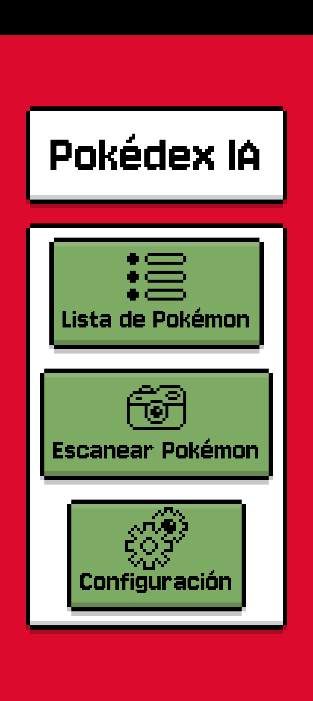
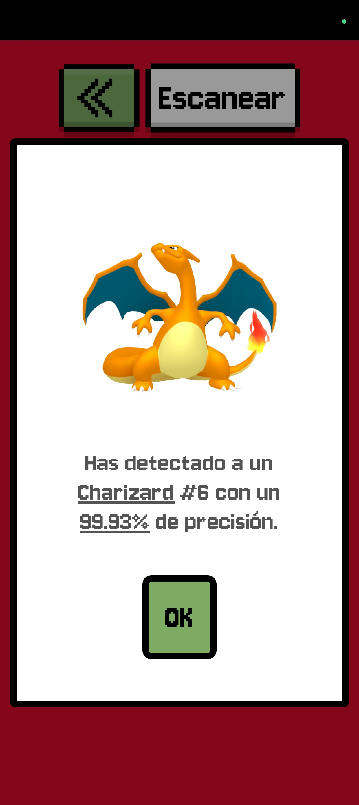
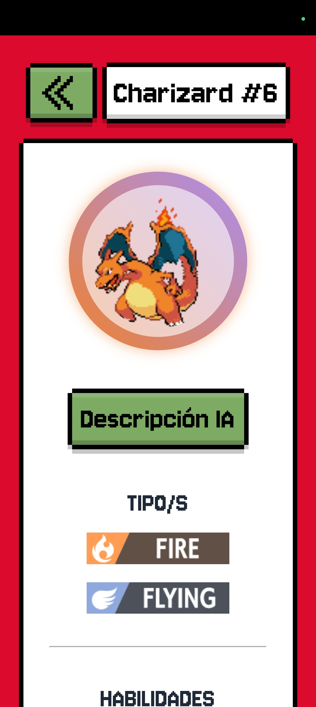
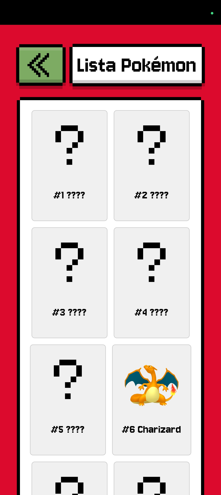
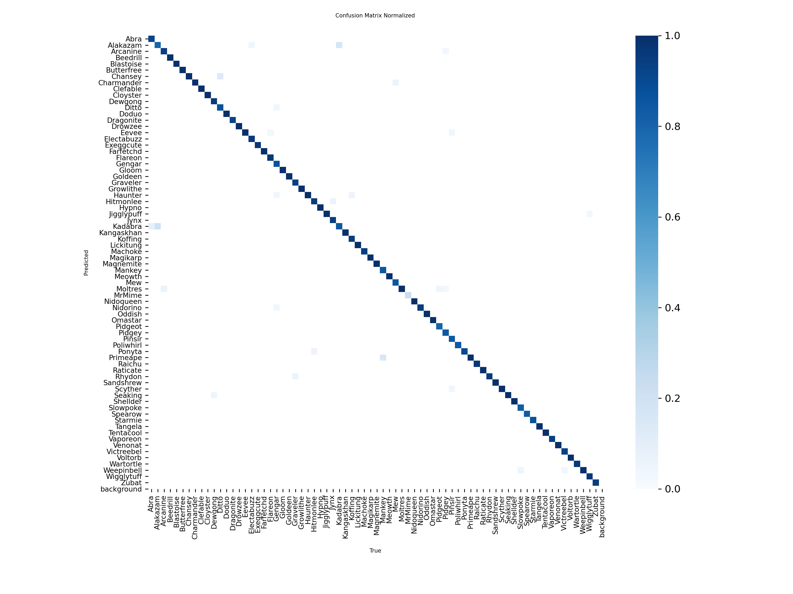

  <h1><a href="https://rubenhp99-pokedexia.netlify.app/">⚡️ POKEDEX IA 📸</a></h1>
  
Pokedex interactiva construida con React que utiliza un modelo de <strong>Detección de Objetos (YOLO)</strong> optimizado para ejecutarse directamente en el navegador web.

---

<h2>✨ Características Principales</h2>
<ul>
  <li><strong>Detección en Tiempo Real:</strong> Utiliza la cámara del dispositivo para identificar Pokémon de la Primera Generación.</li>
  <li><strong>Modelo Web Optimizado:</strong> Implementación de un modelo <strong>YOLOv11 nano</strong> convertido a <strong>TensorFlow.js (TF.js)</strong> y optimizado con <strong>Cuantificación INT8</strong> para una inferencia rápida y ligera en el navegador.</li>
  <li><strong>Sistema de Desbloqueo:</strong> Los Pokémon identificados se desbloquean en una lista inicial bloqueada, emulando la experiencia de un juego.</li>
  <li><strong>Información Completa:</strong> Muestra nombre, sprite, tipos, habilidades, estadísticas y movimientos de cada criatura.</li>
  <li><strong>Generación de Contenido por IA:</strong> Integración con la <strong>API de Gemini</strong> para generar descripciones de Pokémon únicas y con estilo, similares a las del juego.</li>
</ul>

---

<h2>📸 Galería de la Interfaz de Usuario (UI)</h2>

  
  
  
  

---

<h2>⚙️ Tecnologías Utilizadas</h2>
<table>
  <thead>
    <tr>
      <th>Categoría</th>
      <th>Tecnología</th>
      <th>Descripción</th>
    </tr>
  </thead>
  <tbody>
    <tr>
      <td><strong>Frontend/Web</strong></td>
      <td><a href="https://reactjs.org/">React</a> + <a href="https://www.tensorflow.org/js">TensorFlow.js</a></td>
      <td>Interfaz de usuario dinámica y ejecución del modelo de IA en el cliente.</td>
    </tr>
    <tr>
      <td><strong>Modelo de IA</strong></td>
      <td><a href="https://docs.ultralytics.com/es/models/yolo11/">YOLOv11 nano</a></td>
      <td>Arquitectura eficiente para la detección de objetos.</td>
    </tr>
    <tr>
      <td><strong>Servicios de IA</strong></td>
      <td><a href="https://ai.google.dev/gemini">Gemini API</a></td>
      <td>Generación de descripciones de Pokémon.</td>
    </tr>
    <tr>
      <td><strong>Datos de Pokémon</strong></td>
      <td><a href="https://pokeapi.co/">PokéAPI (API Pública)</a></td>
      <td>Obtención de información detallada de estadísticas y movimientos.</td>
    </tr>
  </tbody>
</table>

---

<h2>🧠 Modelo y Optimización</h2>

<h3>Dataset de Entrenamiento</h3>

El modelo fue entrenado con un extenso conjunto de datos de la Primera Generación de Pokémon, obtenido de Kaggle:

<ul>
  <li><strong>Fuente:</strong> <a href="https://www.kaggle.com/datasets/mikoajkolman/pokemon-images-first-generation17000-files">Pokemon Images: First Generation (17000+ files)</a></li>
  <li><strong>Contenido:</strong> Más de 17.000 imágenes para asegurar la robustez del modelo.</li>
</ul>

<h3>Proceso de Optimización (De .pt a TF.js)</h3>

Para garantizar una experiencia fluida en la web, el modelo de PyTorch (<code>.pt</code>) se sometió a un proceso de optimización:

<ol>
  <li>El modelo <strong>YOLOv11 nano</strong> se exportó al formato <strong>TensorFlow.js Graph Model</strong> (<code>model.json</code> y <code>*.bin</code>).</li>
  <li>Se aplicó <strong>Cuantificación a Enteros de 8 bits (INT8)</strong> al convertir los pesos del modelo.</li>
</ol>

La cuantificación INT8 permite una reducción drástica del tamaño del modelo (menor tiempo de descarga) y acelera la inferencia en el navegador sin un impacto significativo en la precisión, un paso crucial para la implementación web.

---

<h2>📊 Matriz de Confusión y Métricas</h2>

La matriz de confusión del modelo optimizado a INT8 demuestra la capacidad de nuestro YOLOv11 nano para distinguir entre los 151 Pokémon. Las métricas clave (Precisión, Recall y mAP) se mantuvieron robustas incluso después de la cuantificación.

  

<h2>🚀 Instalación y Despliegue Local</h2>

Para poner en marcha la Pokedex IA en tu entorno local, sigue estos sencillos pasos. El proyecto utiliza <strong>Vite</strong>, lo que garantiza un despliegue y una recarga en caliente (HMR) muy rápidos.

<h3>Pre-requisitos</h3>
<ul>
  <li><a href="https://nodejs.org/en/download/">Node.js</a> (incluye npm)</li>
  <li><a href="https://git-scm.com/downloads">Git</a></li>
  <li><strong>Clave de la API de Gemini:</strong> Necesaria para la generación de descripciones.</li>
</ul>

<h3>Pasos del Despliegue</h3>
<pre><code>
  
# 1. Clonar el repositorio y acceder al directorio del proyecto
git clone https://github.com/RubenHP99/PokedexIA.git
cd pokedexIA

# 2. Instalar las dependencias de Node.js
npm install

# 3. Configurar las variables de entorno
# Crear un archivo .env en la raíz y añadir la clave de Gemini
echo "VITE_GEMINI_API_KEY=TU_CLAVE_AQUI" > .env

# 4. Desplegar la aplicación en modo desarrollo (usando Vite)
npm run dev</code></pre>

La aplicación se iniciará y estará disponible en tu navegador, generalmente en <code>http://localhost:5173</code>.

